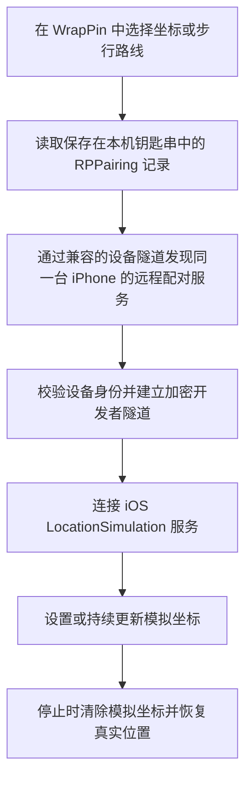

  <picture>
    <source media="(prefers-color-scheme: dark)" srcset="Design/WrapPin-AppIcon-Dark.png">
    <source media="(prefers-color-scheme: light)" srcset="Design/WrapPin-AppIcon-Light.png">
    
  </picture>

<h1 align="center">WrapPin</h1>

  在一张地图上选择、测试并移动 iPhone 向系统报告的位置。

  <strong>当前公开版本：</strong>以 GitHub Releases 为准 · <strong>系统要求：</strong>iOS 27+

  
  
  
  
  

WrapPin 是 Sean Howarth 原项目 [Roam Control](https://github.com/seanhowarthdev/Roam-Control) 的非官方社区中文分支，由 suversal 维护。上游提供设备配对、固定位置、模拟步行和真实位置恢复等核心能力；WrapPin 在此基础上完成简体中文界面与地图标签本地化、首次使用和连接引导、地址与坐标复制、连接诊断、LocalDevVPN 端点选择修复，并加入独立的深浅色图标、版本检查、GitHub 反馈及 X 关注入口。项目保留原作者署名和上游链接，不代表上游官方中文版。

如果这个项目帮到了你，欢迎点一个 **Star**；如果你发现界面、文案、兼容性或连接流程还有改进空间，也欢迎提交 Issue 或 Pull Request。贡献前请先阅读 [CONTRIBUTING.md](CONTRIBUTING.md)。

项目面向开发、质量测试和个人负责任测试，支持固定位置、步行路线、收藏与历史记录，并通过本机配对和兼容的设备隧道建立安全的开发者定位会话。默认使用 LocalDevVPN；设置中的 Shadowrocket 选项只决定跳转目标，不保证普通代理配置能提供所需的设备连接。

> 请只在你拥有并控制的设备上使用。不要用于欺骗他人、伪造证据、规避安全限制，或违反第三方服务规则。

## 当前进展

- 本实验分支为 **1.0.8（Build 16）**；正式公开版本以 GitHub Releases 为准。
- 已完成完整简体中文界面、地图标签本地化、配对与连接引导、中文安装文档和使用手册。
- 已完善地址与坐标复制、连接检测、诊断信息复制、异常会话恢复和真实位置恢复流程。
- 已修复长时间本机配对容易中断，以及误连 USB/Wi-Fi `169.254.x.x` 链路本地地址的问题；已优先使用 LocalDevVPN 端点。
- 已使用正式 Xcode Release Archive 流程生成并校验可供 SideStore 签名的未签名 IPA。
- 已验证前台固定位置、模拟步行和停止恢复流程；长时间锁屏保持仍需更多机型和系统版本测试。
- 本实验分支可选择设备隧道跳转应用，并改进连接失败时的引导；先验证 Wi-Fi 下的 Shadowrocket 设备通道。

## 界面预览

  模拟固定位置 · 模拟步行路线

> 以上为真实功能截图，个别英文或旧名称与当前版本不同；功能布局基本一致，实际界面会跟随系统语言。后续将用 WrapPin 中文真机截图替换。

## 主要功能

- 使用 Apple 地图搜索地点、输入经纬度，或直接轻点地图选点。
- 一键复制所选地点的可读地址或经纬度坐标。
- 启动固定位置后直接更换坐标，无需重新建立整条连接。
- 预览 Apple 地图步行路线，并设置步行速度。
- 在步行期间暂停、继续、原路返回或更换目的地。
- 保存常用地点，快速访问最近使用的位置。
- 会话结束时主动清除模拟坐标并恢复真实位置。
- 为 Wi-Fi 和蜂窝网络提供分开的连接引导与诊断。
- 在设置中选择 LocalDevVPN 或 Shadowrocket 作为连接不可用时的跳转应用。
- 可在设置中检查公开版本、查看 GitHub 仓库、反馈问题、提交功能建议或关注维护者。
- 支持深浅色外观、不同地图样式、动态字体、VoiceOver 和“减弱动态效果”。

## 实现原理

WrapPin 走的是 iOS 的**开发者位置模拟通道**，不是通过代理伪造 IP，也不是修改 Apple 账号或 App Store 地区。

具体过程如下：

1. WrapPin 在当前 iPhone 上生成或导入 RPPairing 配对记录，并保存到仅本机可访问的钥匙串。
2. LocalDevVPN 暴露 iPhone 自己的远程配对服务，WrapPin 通过本地服务发现找到它。这里的“VPN”用于**本机设备通信**，不会提供出口节点，也不会改变公网 IP。
3. 原生引擎校验广播中的设备身份，完成远程配对验证，再建立加密的开发者隧道。
4. WrapPin 通过 iOS 的 LocationSimulation 服务设置坐标。固定位置会定期刷新；步行模式则沿 Apple 地图规划的路线连续更新坐标。
5. 正常停止时，WrapPin 会向系统发送清除模拟位置的指令。若 App 意外退出，下次打开会进入恢复流程。

SwiftUI 界面与原生定位会话之间通过一层精简的 Rust-to-Swift 桥接连接，底层使用固定版本的 MIT 许可 [`idevice`](https://github.com/jkcoxson/idevice) 库。

## 与 WLOC 的区别

这里的 **WLOC** 指通过 Packet Tunnel、代理和本地 CA 改写 Apple `/clls/wloc` Wi-Fi/基站定位响应的一类实现，不特指某一个仓库。不同 WLOC 分支的系统兼容性和安装方式并不完全相同。

| 对比项 | WrapPin | WLOC 类方案 |
| --- | --- | --- |
| 核心原理 | 使用 iOS 开发者位置模拟服务设置坐标 | 拦截并改写 Apple 的 Wi-Fi/基站网络定位响应 |
| 主要影响 | 系统向 App 报告的开发者模拟位置 | 网络定位结果；硬件 GPS 仍可能覆盖它 |
| 公网 IP | **不会改变** | **不会改变**，除非另行使用出口代理/VPN |
| 前置条件 | iOS 27+、开发者模式、本机配对、LocalDevVPN | Packet Tunnel/代理环境、本地 CA；具体要求随实现变化 |
| 证书信任 | 不需要安装 MITM 根证书 | 通常需要安装并信任本地 CA |
| 签名门槛 | 可用 SideStore 或个人开发签名安装，受 Apple 侧载限制 | 原生 Packet Tunnel 版本通常还需要相应 entitlement，部分实现要求付费开发者账号 |
| 使用体验 | 固定位置、路线预览、模拟步行、收藏和恢复流程集成在 App 内 | 通常围绕隧道、证书和目标坐标配置，能力取决于具体客户端 |
| 主要风险点 | iOS 开发者服务或远程配对协议变化；可能与其他 VPN 同时占用系统隧道 | Apple 定位接口的 TLS 校验、缓存和返回格式变化；MITM 方案可能直接失效 |
| 停止方式 | 主动调用系统服务清除模拟位置 | 停止隧道/重写后等待真实网络定位重新生效，可能受缓存影响 |

WLOC 的优点是思路直接，在兼容系统和已有代理环境中可以只处理网络定位；它的缺点是依赖 HTTPS 中间人和网络定位链路，证书、Packet Tunnel 权限、GPS 覆盖以及 iOS 版本变化都会影响结果。部分 WLOC 分支报告 iOS 27 的 TLS 校验变化会阻断旧实现，而另一些分支声称已适配，因此不能把某个分支的结论当成整个 WLOC 方案的统一兼容性保证。

参考实现与说明：[bennix/WLOC](https://github.com/bennix/WLOC)、[Yu9191/wloc](https://github.com/Yu9191/wloc)、[OpenHRTT/wloc](https://github.com/OpenHRTT/wloc)、[H1d3r/wloc-iOS](https://github.com/H1d3r/wloc-iOS)。

### 怎么选

- 如果你的设备是 iOS 27+，希望使用系统开发者模拟通道、模拟连续步行，并且不想安装 MITM 根证书，优先考虑 WrapPin。
- 如果你只研究 Wi-Fi/基站网络定位、已经了解代理和证书信任，并且确认目标 iOS 版本与某个 WLOC 实现兼容，可以评估对应 WLOC 分支。
- 如果目标是更改公网 IP、Apple 账号地区、App Store 商店地区或运营商归属，**两者都不适用**。

## 优点与已知限制

WrapPin 的主要优点：

- 使用开发者位置模拟通道，不需要解密或改写 Apple 定位请求。
- 不需要在系统中信任自签名 MITM 根证书。
- 固定位置和连续步行使用同一套连接，支持会话内更新。
- 配对记录、搜索、收藏、历史和路线均留在 iPhone 本地。
- 提供明确的停止、真实位置恢复和异常中断恢复流程。

当前限制：

- 只支持 iOS 27 或更高版本的实体 iPhone；模拟器只能检查界面。
- 必须开启开发者模式，并完成一次本机配对。
- LocalDevVPN 用于本机隧道，通常不能和另一个正在接管系统 VPN 的工具同时工作。
- SideStore 免费签名受 Apple 的七天刷新、App 数量和 App ID 数量限制。
- 某些 App 会同时检查 IP、Wi-Fi、基站、账号地区、历史缓存或风控信号，因此不保证所有第三方 App 都接受模拟位置。
- 已验证前台固定位置、步行和停止恢复流程；长时间锁屏保持仍需更多真机测试，不作稳定性保证。

## 安装前准备

你需要：

- 一台运行 iOS 27 或更高版本的实体 iPhone。
- 在“设置 → 隐私与安全性”中开启“开发者模式”。
- 在 iPhone 上安装并允许 [LocalDevVPN](https://apps.apple.com/app/localdevvpn/id6755608044) 创建 VPN 配置。
- SideStore，或一台安装了 Xcode 27+ 的 Mac。

WrapPin 暂未通过 App Store 或 TestFlight 分发。第一阶段以 GitHub Release 中的未签名 IPA 为主，必须由使用者使用自己的 Apple 账号签名。

## 使用 SideStore 安装

> [!IMPORTANT]
> 不要在 SideStore 中使用“通过 URL 安装”或直接粘贴 GitHub Release 的 IPA 链接。部分 SideStore 版本会把远程文件名误当成 Bundle ID，从而出现 `com.suversal.wrappin` 与 `WrapPin-版本-build编号` 不匹配的安装错误。请先将 IPA 下载并保存到 iPhone 的“文件”App，再进入 `SideStore → My Apps → + → Choose Files`，从本地选择 IPA 安装。

1. 打开本仓库的 GitHub Releases，下载与版本号对应的 IPA 和 SHA-256 校验值。
2. 在 Mac 终端运行 `shasum -a 256 文件名.ipa`，确认结果与 Release 页面完全一致。
3. 将 IPA 保存到 iPhone 的“文件”App，在 SideStore 的 **My Apps** 中轻点 **+**，选择 **Choose Files** 后选中该 IPA。
4. 让 SideStore 使用你的 Apple 账号完成签名和安装。
5. 更新版本时直接覆盖安装，不要先删除旧版；删除 App 会一并删除本地设置，并可能需要重新配对。

免费 Apple 账号通常需要每七天刷新一次侧载 App，并受同时启用的 App 和 App ID 数量限制。这是 Apple 的签名限制，不是 WrapPin 的订阅规则。完整说明见[安装与侧载](Documentation/Installation.zh-CN.md)。

## 第一次连接

1. 打开 WrapPin，完成首次使用说明。
2. 进入“设备连接”，轻点“配对本机”。
3. iOS 询问时，允许本地网络权限。
4. 打开“设置 → 隐私与安全性 → 开发者模式 → 与 WrapPin 配对”。
5. 输入 WrapPin 显示的六位数配对码。
6. 回到 WrapPin，确认设备状态显示已配对。
7. 打开 LocalDevVPN，允许它创建 VPN 配置并连接本地隧道。
8. 若正在使用其他代理或 VPN，先暂停其系统隧道，再回到 WrapPin 开始连接。

一般只需配对一次。配对记录保存在 iPhone 钥匙串中，不会上传。

## 模拟固定位置

1. 搜索地点、输入经纬度、轻点地图，或从收藏和历史记录中选择位置。
2. 检查地图上的位置点，轻点“开始模拟定位”。
3. 如果出现 LocalDevVPN 或蜂窝网络提示，按页面引导操作。
4. 等待状态显示“模拟定位中”，再打开 Apple 地图确认位置变化。
5. 需要换地点时，在 WrapPin 中选择新位置并轻点“更换模拟位置”，无需重新配对。
6. 测试结束后回到 WrapPin，轻点“停止模拟并恢复”，保持 App 在前台直到恢复完成。

## 模拟步行路线

1. 选择目的地，轻点“预览步行路线”。
2. 检查 Apple 地图返回的路线、距离、预计用时和到达时间。
3. 选择步行速度，轻点“开始模拟步行”。
4. 步行期间可以暂停、继续、原路返回，或在保持连接的情况下更换目的地。
5. 结束时使用“停止模拟并恢复”，不要只强制退出 App。

## Wi-Fi 与蜂窝网络

使用 Wi-Fi 时，确认 LocalDevVPN 显示已连接。如果 WrapPin 一直停在“正在查找这台 iPhone”，先关闭再开启 LocalDevVPN 隧道，然后轻点“重试”。

使用 4G/5G 时：

1. 在 WrapPin 中启动所选位置。
2. 页面提示后暂时关闭蜂窝网络。
3. 回到 WrapPin，等待它发现本机；必要时轻点“继续”。
4. 安全连接建立后，按提示重新开启蜂窝网络。

临时关闭蜂窝网络只用于建立本机连接。定位会话启动后，可以恢复正常使用移动数据。

## 停止、恢复与排障

正常结束时务必在 WrapPin 内停止会话。恢复完成前，不要使用导航、出行、紧急求助或位置共享类 App。

如果 App 意外退出，重新打开后会出现恢复页面，可以继续上次任务，或选择“恢复真实位置”。恢复页面不会自动开始任何操作。

常见问题：

- **一直找不到 iPhone：**确认 LocalDevVPN 已连接、关闭其他系统 VPN、重新开关 LocalDevVPN，并确认配对记录属于当前设备。
- **提示配对记录失效：**移除旧配对后重新执行“配对本机”。
- **某个 App 的位置没变：**先用 Apple 地图确认。目标 App 可能仍在使用缓存、IP、Wi-Fi、基站或账号地区。
- **需要提交问题：**打开“设置 → 连接检测”，运行检查并复制诊断信息。不要上传配对文件、PIN、签名材料、账号凭据或私人位置。

更完整的操作说明见[使用手册](Documentation/UserGuide.zh-CN.md)。

## 从源码编译

1. 克隆仓库，使用 Xcode 27 或更高版本打开 `WrapPin.xcodeproj`。
2. 选择 `WrapPin` target。
3. 在 **Signing & Capabilities** 中选择你自己的 Apple 开发者团队。
4. 连接实体 iPhone，选择该设备并按 **Run**。

工程文件、target、scheme 和源码目录使用内部标识 `WrapPin`；安装后的 App 名称显示为 `WrapPin`。

普通构建直接使用仓库中的 `Frameworks/WrapPinPairingFFI.xcframework`。只有修改 `Native/WrapPinPairingFFI` 后才需要重新构建框架，步骤见[构建与发布指南](Documentation/BuildAndRelease.md)。

## 隐私与许可证

位置、坐标、搜索、收藏、历史记录、步行路线和配对记录均保存在 iPhone 本地。匿名使用统计默认关闭；启用后也不会发送位置、搜索、路线、配对数据、设备名称或诊断原文。详见[隐私说明](Documentation/Privacy.md)。

项目当前使用 [PolyForm Noncommercial License 1.0.0](LICENSE)，源代码可查看，并允许按条款进行非商业使用、修改和分发；它不是 OSI 认可的开源许可证。第三方依赖保留各自的许可证。

本版本的改动和验证范围见 [CHANGELOG](CHANGELOG.md)。

## 反馈与贡献

普通问题和可复现的故障请使用本仓库的 GitHub Issues。安全问题请通过 GitHub Security Advisories 私下报告。提交内容前请删除配对文件、PIN、签名材料、账号凭据和私人位置。

你也可以在 WrapPin 的“设置 → 社区”中轻点“关注我”，或直接访问 X 上的 [@suversal](https://x.com/suversal)。

本项目由 suversal 作为非官方社区分支维护。核心实现来源、原作者版权声明、上游项目链接和第三方许可证均予以保留。
